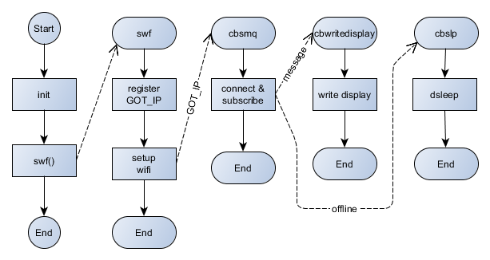

# A simple IoT power meter display for NodeMCU / Lua subscribed to measurements by [MQTT API](https://en.wikipedia.org/wiki/MQTT).

To use the code, copy init.default.lua to init.lua, and nodevars.default.lua to nodevars.lua and customise the latter to suit your needs.

See project described at [ESP8266 remote power display for energy monitor – EV3 – 5V display](http://owenduffy.net/blog/?p=11227) .

Tested on:
NodeMCU custom build by frightanic.com
	branch: master
	commit: 2e67ff5a639a13260fd4fb3c3b627ccdc2845616
	SSL: true
	modules: adc,bit,dht,encoder,file,gpio,http,mqtt,net,node,ow,spi,tmr,uart,wifi,tls
 build 	built on: 2017-09-08 02:05
 powered by Lua 5.1.4 on SDK 2.1.0(116b762)

